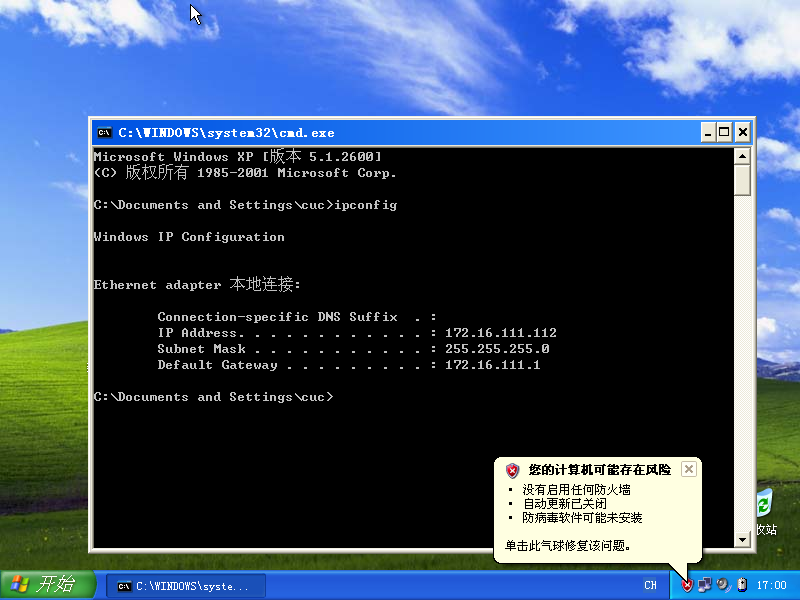
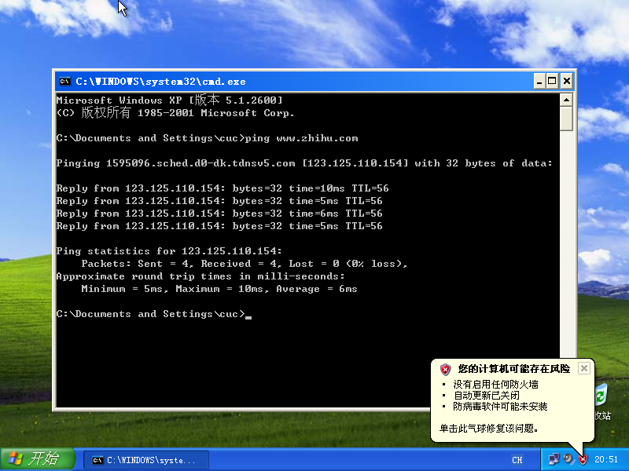

# 基于 VirtualBox 的网络攻防基础环境搭建

## 实验目的

* 掌握 VirtualBox 虚拟机的安装与使用
* 掌握 VirtualBox 的虚拟网络类型和按需配置
* 掌握 VirtualBox 的虚拟硬盘多重加载

## 实验环境

1. VirtualBox 6.1.26
2. 攻击者主机（Attacker）：Kali Rolling 2109.2
3. 网关（Gateway, GW）：Debian Buster
4. 靶机（Victim）：From Sqli to shell / xp-sp3 / Kali

## 实验要求完成情况

1. 虚拟硬盘配置成多重加载
2. 已经搭建满足拓扑图所示的虚拟机网络拓扑
3. 可以完成网络连通性测试有：

* [x] 靶机可以直接访问攻击者主机

* [x] 攻击者主机无法直接访问靶机

* [x] 网关可以直接访问攻击者主机和靶机

* [x] 靶机的所有对外上下行流量必须经过网关
  
* [x] 所有节点均可以访问互联网

## 实验过程

### 配置vbox中条件阶段

1. 先导入对应的虚拟机，然后释放，调节类型为"多重加载" 
2. 再添加NAT网络 如图所示：
3. 最后展示所有的vbox网络配置以及多重加载情况：
   
   
   
   
   
   

### 配置网络拓扑阶段

1. 查看网关的各网络地址： 

   * 发现居然全部已经配置好了，从图中可以看到intnet1为`172.16.111.1/24`，intnet2为`172.16.222.1/24`。

2. 配置dnsmasq(dnsmasq以及被提前改好)
   * 通过```apt install dnsmasq```的语句来安装dnsmasq
   * 添加配置文件：

      ```# /etc/dnsmasq.d/gw-enp09.conf
      interface=enp0s9
      dhcp-range=172.16.111.100,172.16.111.150,240h

      # /etc/dnsmasq.d/gw-enp010.conf
      interface=enp0s10
      dhcp-range=172.16.222.100,172.16.222.150,240h
      ```

3. 再查看两个xp虚拟机的情况：   
   * 全部都在对应的内部网络之内

4. 再查看另一个debian victim和kali victim的内部网络地址：    。全部都在对应的内部网络之内

5. 因为要保证内部受害者能访问攻击者的，而攻击者不可访问受害者，故攻击者的设置为NAT网络，如图所示：
    

* 以上表明满足拓扑结构的设计，后续我们来进行验证

### 验证实验结果

1. 靶机可以直接访问攻击者主机  

   * 直接在命令行使用`ping`语句来进行验证：
   
   
   
   

2. 攻击者主机无法直接访问靶机
   

3. 网关可以直接访问攻击者主机和靶机
    

4. 靶机的所有对外上下行流量必须经过网关(操作有点复杂,所以只用wireshark展示一个)
   1. 在gateway使用语句```sudo apt install tcpdump``` 以及 ```sudo tcpdump -i ens0s9 -n -w 20210907.1.pcap```可以表明：

   2. 检测intnet1的流量得到20210907.1.pcap
   

5. 所有节点均可以访问互联网
   * 使用语句```ping www.zhihu.com```来访问互联网

   
   
   
   
   
   

### 参考资料

1. [网络安全实验课件](https://c4pr1c3.gitee.io/cuc-ns/chap0x01/exp.html)

2. [网络安全b站录像](https://www.bilibili.com/video/BV1CL41147vX?p=11&spm_id_from=pageDriver)
