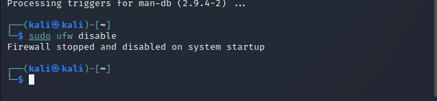
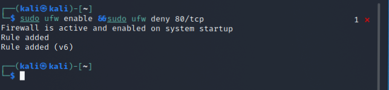

[TOC]

# 基于 Scapy 编写端口扫描器

## 实验环境配置情况

1. 攻击者主机(由于是kali，所以已经自带了scapy)
   * 08:00:27:d3:e9:5a / eth0
   * 172.16.111.114
2. 受害者主机
   * 08:00:27:c8:03:61 / enp0s3
   * 172.16.111.103
3. 网关
   * 08:00:27:b8:da:76 / enp0s9
   * 172.16.111.1

## 实验环境

1. python 3.9

2. scapy 2.4.3

3. nmap 7.80

4. Linux kali 5.7.0-kali1-amd64

## 实验完成情况

* [x] 完成以下扫描技术的编程实现
* [x] TCP connect scan / TCP stealth scan
* [x] TCP Xmas scan / TCP fin scan / TCP null scan
* [x] UDP scan
* [x] 上述每种扫描技术的实现测试均需要测试端口状态为：开放、关闭 和 过滤 状态时的程序执行结果
* [x] 提供每一次扫描测试的抓包结果并分析与课本中的扫描方法原理是否相符？如果不同，试分析原因；
* [x] 在实验报告中详细说明实验网络环境拓扑、被测试 IP 的端口状态是如何模拟的
* [x] （可选）复刻 nmap 的上述扫描技术实现的命令行参数开关

## 实验原理介绍

1. TCP connect scan 与 TCP stealth scan 使用最基本的 TCP 三次握手链接建立机制，建立一个链接到目标主机的特定端口上。首先发送一个 SYN 数据包到目标主机的特定端口上，如果接收到的是一个 SYN/ACK 数据包，则说明端口是开放状态的；如果接收到的是一个 RST/ACK 数据包，通常意味着端口是关闭的并且链接将会被重置；而如果目标主机没有任何响应则意味着目标主机的端口处于过滤状态。理论图解如下：

2. TCP Xmas scan、TCP fin scan及TCP null scan不涉及三次交互,区别是：

* TCP Xmas scan发送一个 TCP 包，并对 TCP 报文头 FIN、URG 和 PUSH 标记进行设置。若是关闭的端口则响应 RST 报文，开放或过滤状态下的端口则无任何响应
  
* TCP fin scan仅发送 FIN 包，它可以直接通过防火墙.如果端口是关闭的就会回复一个 RST 包，如果端口是开放或过滤状态则对 FIN 包没有任何响应。

* TCP null scan发送一个 TCP 数据包，关闭所有 TCP 报文头标记。只有关闭的端口会发送 RST 响应。

3. UDP是无连接的协议，通过发送UDP+port得到的回复确定被扫描主机的状态

   ``` c
   Open：no response / server responds to the client with a UDP packet；
   Closed：ICMP error type 3 and code 3
   filtered：no response / ICMP error type 3 and code 1,2,3,9,10,13
   ```

## 实验过程

### 端口状态模拟(后续类似的不重复了)

1. close:对应端口没有开启监听, 防火墙没有开启
   `ufw unable`
   

2. open:对应端口开启监听: apache2基于TCP, 在80端口提供服务; DNS服务基于UDP,在53端口提供服务。防火墙处于关闭状态。

   ```bash
   systemctl start apache2 # tcp测试的是80端口
   systemctl start dnsmasq # udp测试的是53端口

   ```

   

3. filter: 对应端口开启监听, 防火墙开启。

   ```bash
   ufw enable && ufw deny 80/tcp
   ufw enable && ufw deny 53/udp

   ```

   

### TCP connect scan

```python
#! /usr/bin/python

from scapy.all import *

dst_ip = "172.16.111.103"
src_port = RandShort()
dst_port=80

tcpconnectscan_pkts = sr1(IP(dst=dst_ip)/TCP(sport=src_port,dport=dst_port,flags="S"),timeout=10)
if tcpconnectscan_pkts is None:
    print("Filtered")
elif(tcpconnectscan_pkts.haslayer(TCP)):
    if(tcpconnectscan_pkts.getlayer(TCP).flags == 0x12):
        print("Open")
    elif (tcpconnectscan_pkts.getlayer(TCP).flags == 0x14):
        print("Closed")
```

1. close (以下顺序一般按自己编程程序的结果、wireshark抓包结果、nmap验证结果排序)
1.png)
2.png)
3.png)

2. open
1.png)
2.png)
3.png) 

* 这里符合三次握手的定义

3. filter

2.png)
3.png)

* 他这个`nmap`语句需要加上`-Pn`才好使

### TCP stealth scan

```python
#! /usr/bin/python

from scapy.all import *

dst_ip = "172.16.111.103"
src_port = RandShort()
dst_port = 80

pkts = sr1(IP(dst=dst_ip)/TCP(sport=src_port, dport=dst_port, flags="S"), timeout=10)
if pkts is None:
    print("Filtered")
elif(pkts.haslayer(TCP)):
    if(pkts.getlayer(TCP).flags == 0x12):
        send_rst = sr(IP(dst=dst_ip)/TCP(sport=src_port,dport=dst_port, flags="R"), timeout=10)
        print("Open")
    elif (pkts.getlayer(TCP).flags == 0x14):
        print("Closed")
elif(pkts.haslayer(ICMP)):
    if(int(pkts.getlayer(ICMP).type) == 3 and int(pkts.getlayer(ICMP).code) in [1, 2, 3, 9, 10, 13]):
        print("Filtered")
```

1. close 
1.png)
2.png)
3.png)

2. open
1.png)
2.png)

3. filter
1.png)
2.png)
3.png)

* 他这个`nmap`语句需要加上`-Pn`才好使

### TCP Xmas scan

```python
#! /usr/bin/python

import logging
logging.getLogger("scapy.runtime").setLevel(logging.ERROR)

from scapy.all import *

dst_ip = "172.16.111.103"
src_port = RandShort()
dst_port = 80

tcpxmasscan_pkts = sr1(
    IP(dst=dst_ip)/TCP(dport=dst_port, flags="FPU"), timeout=10)
if tcpxmasscan_pkts is None:
    print("Open|Filtered")
elif(tcpxmasscan_pkts.haslayer(TCP)):
    if(tcpxmasscan_pkts.getlayer(TCP).flags == 0x14):
        print("Closed")
elif(tcpxmasscan_pkts.haslayer(ICMP)):
    if(int(tcpxmasscan_pkts.getlayer(ICMP).type) == 3 and int(tcpxmasscan_pkts.getlayer(ICMP).code) in [1, 2, 3, 9, 10, 13]):
        print("Filtered") 
```

1. close
1.png)
2.png)
3.png)

2. open
1.png)
2.png)
3.png)

3. filter
1.png) 
2.png)
13.png)

* 因为开放或过滤状态下的端口则无任何响应，所以用scapy无法分辨出结果，只能得到`Open|Filtered`

### TCP fin scan

```python
#! /usr/bin/python

import logging
logging.getLogger("scapy.runtime").setLevel(logging.ERROR)

from scapy.all import *

dst_ip = "172.16.111.103"
src_port = RandShort()
dst_port = 80

tcpfinscan_pkts = sr1(
    IP(dst=dst_ip)/TCP(dport=dst_port, flags="F"), timeout=10)
if tcpfinscan_pkts is None:
    print("Open|Filtered")
elif(tcpfinscan_pkts.haslayer(TCP)):
    if(tcpfinscan_pkts.getlayer(TCP).flags == 0x14):
        print("Closed")
elif(tcpfinscan_pkts.haslayer(ICMP)):
    if(int(tcpfinscan_pkts.getlayer(ICMP).type) == 3 and int(tcpfinscan_pkts.getlayer(ICMP).code) in [1, 2, 3, 9, 10, 13]):
        print("Filtered")
```

1. close(open和filt的python运行结果与nmap合并)
1.png)
2.png)
3.png)

2. open
13.png)
2.png)

3. filter
13.png)
2.png)

### TCP null scan

```python
#! /usr/bin/python

import logging
logging.getLogger("scapy.runtime").setLevel(logging.ERROR)

from scapy.all import *

dst_ip = "172.16.111.103"
src_port = RandShort()
dst_port = 80

tcpnullscan_pkts = sr1(
    IP(dst=dst_ip)/TCP(dport=dst_port, flags=""), timeout=10)
if tcpnullscan_pkts is None:
    print("Open|Filtered")
elif(tcpnullscan_pkts.haslayer(TCP)):
    if(tcpnullscan_pkts.getlayer(TCP).flags == 0x14):
        print("Closed")
elif(tcpnullscan_pkts.haslayer(ICMP)):
    if(int(tcpnullscan_pkts.getlayer(ICMP).type) == 3 and int(tcpnullscan_pkts.getlayer(ICMP).code) in [1, 2, 3, 9, 10, 13]):
        print("Filtered")
```

1. close(open和filt的python运行结果与nmap合并)
1.png)
2.png)
3.png)

2. open
13.png)
2.png)

3. filter
13.png)
2.png)

### UDP scan

```python
#! /usr/bin/python

import logging
logging.getLogger("scapy.runtime").setLevel(logging.ERROR)

from scapy.all import *

dst_ip = "172.16.111.103"
src_port = RandShort()
dst_port = 53
dst_timeout = 10

def udp_scan(dst_ip,dst_port,dst_timeout):
    udp_scan_resp = sr1(IP(dst=dst_ip)/UDP(dport=dst_port), timeout=dst_timeout)
    if(udp_scan_resp is None):
        print("Open|Filtered")
    elif(udp_scan_resp.haslayer(UDP)):
        print("Open")
    elif(udp_scan_resp.haslayer(ICMP)):
        if(int(udp_scan_resp.getlayer(ICMP).type) == 3 and int(udp_scan_resp.getlayer(ICMP).code) == 3):
            print("Closed")
        elif(int(udp_scan_resp.getlayer(ICMP).type) == 3 and int(udp_scan_resp.getlayer(ICMP).code) in [1, 2, 9, 10, 13]):
            print("Filtered")
        elif(udp_scan_resp.haslayer(IP) and udp_scan_resp.getlayer(IP).proto == IP_PROTOS.udp)
            print("Open")

udp_scan(dst_ip,dst_port,dst_timeout)
```

1.close (这里很奇怪，使用`-sU`参数的时候失败了，得使用`-sT`参数，但是nmap得出的结果是`tcp/53`)
1.png)
2.png)

2. open
1.png)
2.png)
3.png)

3. filter
1.png)
2.png)
3.png)

* 最后一次`-sU`终于成功了，原来得用`sudo`...

## 实验总结

1. 提供每一次扫描测试的抓包结果并分析与课本中的扫描方法原理是否相符？如果不同，试分析原因

* 答：结果是相符合的，但是部分只通过返回的包无法准确的得到结果，只会得到`open\filter`

2. nmap使用`-sU`参数无法执行，需要使用`sudo`进行提权

3. 在对过滤状态的端口进行扫描时，nmap需要加上`-Pn`参数

## 实验参考

1. [网络安全课件](https://c4pr1c3.gitee.io/cuc-ns/)

2. [参考作业](https://github.com/CUCCS/2021-ns-public-EddieXu1125/tree/chap0x05/chap0x05) 

3. [scapy的有关文档](https://www.osgeo.cn/scapy/usage.html)


