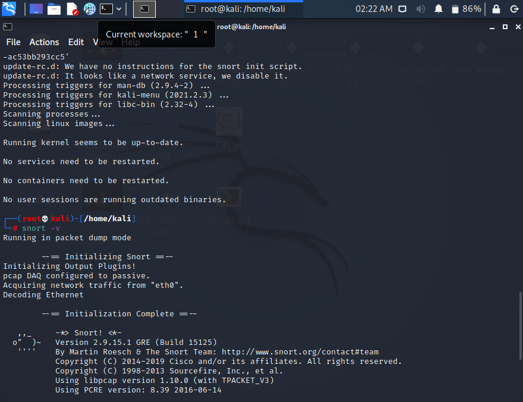

# 实验九 入侵检测

## 环境配置

1. kali victim(172.16.111.114)

2. kali attacker(172.16.111.103)

## Snort安装

```bash
# 禁止在apt安装时弹出交互式配置界面
export DEBIAN_FRONTEND=noninteractive
apt install snort
# 踩的坑
# 1.建议在kali里安装
# 2.export和install的用户应该是一样，不要一下sudo一下普通用户
```



### 开始实验

#### 实验一：配置snort为嗅探模式

```bash
# 显示IP/TCP/UDP/ICMP头
snort –v

# 显示应用层数据
snort -vd

# 显示数据链路层报文头
snort -vde

# -b 参数表示报文存储格式为 tcpdump 格式文件
# -q 静默操作，不显示版本欢迎信息和初始化信息
snort -q -v -b -i eth0 "port not 22"

# 这个 eth0还是eth1看自己的虚拟机情况

# 使用 CTRL-C 退出嗅探模式
# 嗅探到的数据包会保存在 /var/log/snort/snort.log.<epoch timestamp>
# 其中<epoch timestamp>为抓包开始时间的UNIX Epoch Time格式串
# 可以通过命令 date -d @<epoch timestamp> 转换时间为人类可读格式
# exampel: date -d @1511870195 转换时间为人类可读格式
# 上述命令用tshark等价实现如下：
tshark -i eth0 -f "port not 22" -w 1_tshark.pcap
```

* 以下是实验结果：

    

    

* vim查看一下抓的的结果，虽然是乱码：
        

#### 实验二：配置并启用snort内置规则

```bash
# /etc/snort/snort.conf 中的 HOME_NET 和 EXTERNAL_NET 需要正确定义
# 例如，学习实验目的，可以将上述两个变量值均设置为 any
snort -q -A console -b -i eth0 -c /etc/snort/snort.conf -l /var/log/snort/
```

* 配好any :

#### 实验三：自定义snort规则

```bash
# 新建自定义 snort 规则文件
cat << EOF > /etc/snort/rules/cnss.rules
alert tcp \$EXTERNAL_NET any -> \$HTTP_SERVERS 80 (msg:"Access Violation has been detected on /etc/passwd ";flags: A+; content:"/etc/passwd"; nocase;sid:1000001; rev:1;)
alert tcp \$EXTERNAL_NET any -> \$HTTP_SERVERS 80 (msg:"Possible too many connections toward my http server"; threshold:type threshold, track by_src, count 100, seconds 2; classtype:attempted-dos; sid:1000002; rev:1;)
cat << EOF > /etc/snort/rules/icmp-info.rules
alert icmp $EXTERNAL_NET any -> $HOME_NET any (msg:"ICMP Large ICMP Packet"; dsize:>900; reference:arachnids,246; classtype:bad-unknown; sid:499; rev:4;)
EOF

# 增加了判断900B以上的包
# 添加配置代码到 /etc/snort/snort.conf
include $RULE_PATH/cnss.rules

snort -q -A fast -b -i eth0 -c /etc/snort/snort.conf -l /var/log/snort/
```

* 以下是结果(第一个是失败的，因为eth0设置错了,第二个有我们自己设置的对于大的包，输出了报警，这里参考了别的同学的自定义设计)：


#### 实验四：和防火墙联动

```bash
# 这里我是直接拖放到了desktop上
# 解压缩 Guardian-1.7.tar.gz
tar zxf guardian.tar.gz

# 安装 Guardian 的依赖 lib
apt install libperl4-corelibs-perl
```

本次实验需要的一个最小化的实验环境是2台主机，网络拓扑信息如下：

* VM-1 IP: 172.16.111.103 eth0 直接运行 nmap 扫描 VM-2

* VM-2 IP: 172.16.111.114 eth0 直接运行 snort 和 guardian.pl

开始实验之前，由于设置的是内部网络在同一子网下，VM-1 和 VM-2 可以互相双向访问。
在VM-2上先后开启 snort 和 guardian.pl

```bash
# 开启 snort
snort -q -A fast -b -i eth1 -c /etc/snort/snort.conf -l /var/log/snort/

# guardian.tar.gz 解压缩后文件均在 /Desktop/guardian 下
cd /Desktop/guardian

# vim简单的配置一下 guardian.conf
HostIpAddr      172.16.111.114
Interface       eth0
```


```bash
# 启动 guardian.pl
perl guardian.pl -c guardian.conf
```

在VM-1上用 `nmap` 暴力扫描 VM-2：

```bash
nmap 192.168.56.102 -A -T4 -n -vv
```


最后呈现在VM2的结果(可以在三个地方都看到VM1暴力扫描VM2的记录)：


### 实验思考题

1. IDS与防火墙的联动防御方式相比IPS方式防御存在哪些缺陷？是否存在相比较而言的优势？
 
    ```bash
    先使用大量篇幅介绍概念
    1. IDS是依照一定的安全策略，对网络、系统的运行状况进行监视，尽可能发现各种攻击企图、攻击行为或者攻击结果，以保证网络系统资源的机密性、完整性和可用性。打个比喻——假如防火墙是一幢大厦的门锁，那么IDS就是这幢大厦里的监视系统。一旦小偷进入了大厦，或内部人员有越界行为，只有实时监视系统才能发现情况并发出警告。与防火墙不同的是，IDS入侵检测系统是一个旁路监听设备，没有也不需要跨接在任何链路上，无须网络流量流经它便可以工作。因此，对IDS的部署的唯一要求是：`IDS应当挂接在所有所关注的流量都必须流经的链路上`
    IDS在交换式网络中的位置一般选择为：尽可能靠近攻击源、尽可能靠近受保护资源。

    2. IPS系统是电脑网络安全设施，是对防病毒软件和防火墙的补充。 IPS系统是一部能够监视网络或网络设备的网络资料传输行为的计算机网络安全设备，能够即时的中断、调整或隔离一些不正常或是具有伤害性的网络资料传输行为。
    对于部署在数据转发路径上的IPS，可以根据预先设定的安全策略，对流经的每个报文进行深度检测（协议分析跟踪、特征匹配、流量统计分析、事件关联分析等），如果一旦发现隐藏于其中网络攻击，可以根据该攻击的威胁级别立即采取抵御措施，这些措施包括（按照处理力度）：向管理中心告警；丢弃该报文；切断此次应用会话；切断此次TCP连接。
    ```

    * 不能光介绍概念而逃避问题。回答一下问题，由于IDS本身只能检测出恶意行为，但不能根据行为进行阻断，而防火墙看似可以弥补这一缺陷，实际上IPS系统可以实施深层防御安全策略，即可以在应用层检测出攻击并予以阻断，这是防火墙所做不到的，当然也是入侵检测产品所做不到的。

    * IDS优势当然是有的，我们之前在概念中提到IPS最好部署在网络外部而阻绝攻击行为，而IDS多是部署在内部,IDS系统的核心价值在于通过对全网信息的分析，了解信息系统的安全状况，进而指导信息系统安全建设目标以及安全策略的确立和调整，IPS的价值在于安全策略的实施

### 实验参考

1. 师哥的实验9：[实验九](https://github.com/CUCCS/2020-ns-public-LyuLumos/tree/ch0x09/ch0x09)

2. IDS与IPS的网络文章：
 
* [什么是IDS、IPS及它们之间的区别](https://zhuanlan.zhihu.com/p/96942352)
* [「网络安全」安全设备篇（防火墙-IDS-IPS）](https://zhuanlan.zhihu.com/p/95664193)
* [网络安全之防火墙、IDS、IPS之间的区别](http://www.elecfans.com/application/Security/1007723.html)  

